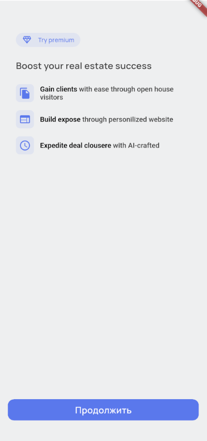

# Тестовазя задача MSTech

## Структура проекта

    - features (страницы, виджеты, состояния)
        - init (Страница инициализации)
        - home (Домашняя страница)
        - paywall (Страница с онбордингом и с paywall)
    - data (работа с данными)
    - core (роутеры, конфиги, и тд)
    - blocs (глобальные состояния)
    - service (различные сервисы)
    - shared (общие - иконки, темы и тд)

## Что можно было улучшить

    - Все состояния вынести в отдельный cubit
    - Доработать UX
    

